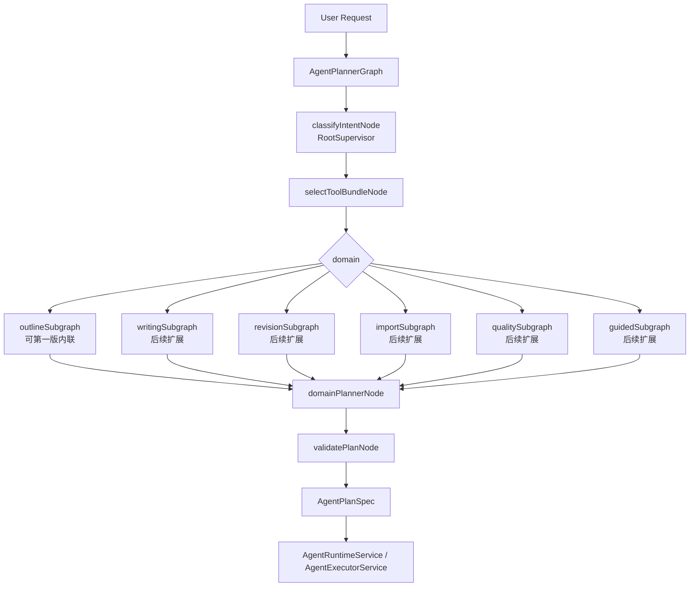

# Agent Supervisor Planner 架构设计

> 最后更新：2026-05-09
> 状态：开发设计文档，待实现
> 范围：Agent Planner 编排层、LangGraph TS 接入、多层 supervisor、ToolBundle 过滤、Plan 校验与可观测性
> 相关计划：`docs/architecture/agent-supervisor-planner-development-plan.md`

## 1. 背景

当前 Agent Planner 的主入口在 `apps/api/src/modules/agent-runs/agent-planner.service.ts`。它把用户目标、上下文、任务类型、工具说明和输出契约组装成一次 LLM JSON Planner 调用。

当前关键问题是：Planner 每次都会通过 `ToolRegistryService.listManifestsForPlanner()` 获取全量工具手册，再写入 prompt 的 `availableTools`。随着工具数增长，Planner 需要同时理解大纲、章节细纲、正文、修改、导入、世界观、时间线、质检、引导式创作等全部能力，导致：

1. prompt 体积过大，`availableTools` 成为主要 token 成本。
2. 任务边界变软，例如“生成卷大纲”可能误走章节细纲链路。
3. 新工具越多，Planner 越容易被相邻工具干扰。
4. prompt 规则不断补丁化，长期难以维护。
5. 测试只能验证最终 plan，很难单独验证“路由”和“工具可见性”。

此前基线测量显示，全量 `availableTools` compact JSON 已超过 100k 字符，整个最小 Planner prompt 约 170k 字符量级。即使后续继续压缩 manifest，只要仍然全量上传，成本和误判风险都会继续随工具数增长。

## 2. 目标

本设计目标是把当前单体 Planner 改造成可扩展的 supervisor planner 架构：

1. 用 RootSupervisor 先判断任务领域和意图。
2. 用 ToolBundleSelector 只暴露当前任务需要的工具。
3. 用 DomainPlanner 复用现有 `AgentPlanSpec` 输出契约。
4. 用 PlanValidator 统一拦截越权工具、跨 bundle 工具和高风险写入。
5. 用 LangGraph TS 负责 Planner 编排，而不是替代现有 Agent Runtime。
6. 保留现有 `AgentExecutorService`、审批、Act 写入和 ToolRegistry 安全边界。
7. 为后续新增领域 supervisor、子图和工具包提供稳定扩展点。

最终效果：

```text
User Request
  -> RootSupervisor
  -> ToolBundleSelector
  -> DomainSubgraph 或 DomainPlanner
  -> PlanValidator
  -> 现有 AgentExecutorService
  -> 现有审批 / 工具执行 / 写入链路
```

## 3. 非目标

1. 不让子 Agent 直接调用工具或写数据库。
2. 不替换 `AgentExecutorService`、`AgentRuntimeService`、审批模型或 Tool 实现。
3. 不把 Python LangGraph 引入项目；项目是 NestJS + TypeScript，使用 `@langchain/langgraph`。
4. 不把所有领域一次性拆成复杂自治 Agent。
5. 不为小说内容生成低质量 deterministic fallback。
6. 不在 Planner 层补齐缺失章节、缺失字段、缺失 `craftBrief`。

## 4. 核心结论

本项目适合使用“轻量多层 supervisor”，但 supervisor 的职责必须收窄：

```text
Supervisor 负责路由
ToolBundleSelector 负责工具隔离
SpecialistPlanner 负责生成 AgentPlanSpec
PlanValidator 负责统一守门
Executor 负责真实执行
```

这是一种 2.5 层结构：

```text
RootSupervisor
  -> DomainSupervisor 可选
    -> SpecialistPlanner
      -> Existing Agent Runtime
```

第一版不需要让每个领域都有完整 autonomous agent。先把“路由、工具过滤、计划校验、可观测性”落稳，再逐步把高频领域拆成 subgraph。

## 5. 总体架构



LangGraph 只包住 Planner 编排层。Graph 输出仍然是当前系统已经使用的 `AgentPlanSpec`。

## 6. LangGraph 选型

使用官方 JavaScript / TypeScript 包：

```bash
pnpm --dir apps/api add @langchain/langgraph @langchain/core
```

官方 JS 文档说明 LangGraph 是低层编排框架，关注 stateful workflow、durable execution、human-in-the-loop 和自定义 agent orchestration。它不要求必须使用 LangChain model abstraction，因此第一版可以继续复用项目现有 `LlmGatewayService`，只把 LangGraph 当编排运行时。

参考资料：

- `https://docs.langchain.com/oss/javascript/langgraph`
- `https://docs.langchain.com/oss/javascript/langgraph/install`
- `https://docs.langchain.com/oss/javascript/langgraph/use-graph-api`

## 7. Graph State

建议新增统一状态类型：

```ts
export type AgentPlannerDomain =
  | 'outline'
  | 'writing'
  | 'revision'
  | 'worldbuilding'
  | 'timeline'
  | 'import'
  | 'quality'
  | 'guided'
  | 'project_ops'
  | 'general';

export interface RouteDecision {
  domain: AgentPlannerDomain;
  intent: string;
  confidence: number;
  reasons: string[];
  volumeNo?: number;
  chapterNo?: number;
  needsApproval?: boolean;
  needsPersistence?: boolean;
  ambiguity?: {
    needsClarification: boolean;
    questions: string[];
  };
}

export interface SelectedToolBundle {
  bundleName: string;
  strictToolNames: string[];
  optionalToolNames: string[];
  deniedToolNames?: string[];
  selectionReason: string;
}

export interface AgentPlannerGraphState {
  goal: string;
  context?: AgentContextV2;
  defaults: PlannerOutputDefaults;
  route?: RouteDecision;
  selectedBundle?: SelectedToolBundle;
  selectedTools?: PlannerPromptToolManifest[];
  plan?: AgentPlanSpec;
  validationErrors?: string[];
  diagnostics: {
    graphVersion: string;
    promptChars?: number;
    selectedToolCount?: number;
    allToolCount?: number;
    nodes: Array<{ name: string; status: 'ok' | 'failed'; detail?: string }>;
  };
}
```

状态原则：

1. 用户目标和 `AgentContextV2` 只在 graph state 中传递一次。
2. route 是结构化结果，不依赖自然语言重新解析。
3. selectedTools 是 Planner 唯一可见工具清单。
4. diagnostics 必须能回放每个节点的关键决策。

## 8. 节点设计

### 8.1 classifyIntentNode

职责：RootSupervisor，只判断任务领域、意图和关键槽位。

输入：

- `goal`
- `context.session`
- `availableTaskTypes`
- 轻量领域说明

输出：

- `RouteDecision`

要求：

1. 不接收 `availableTools`。
2. 不生成 `AgentPlanSpec`。
3. 不生成小说内容。
4. 低置信度时进入澄清路径，不 fallback 到全工具 Planner。
5. 只输出严格 JSON，并由 zod 或本地校验器验证。

示例输出：

```json
{
  "domain": "outline",
  "intent": "generate_volume_outline",
  "confidence": 0.91,
  "volumeNo": 1,
  "needsApproval": true,
  "needsPersistence": true,
  "reasons": ["用户只要求第一卷大纲，没有要求章节细纲或拆章"]
}
```

### 8.2 selectToolBundleNode

职责：根据 `RouteDecision` 选择工具包。

输入：

- `route`
- `ToolBundleRegistry`
- `ToolRegistryService`

输出：

- `SelectedToolBundle`
- `selectedTools`

要求：

1. selectedTools 只能来自注册工具。
2. strictToolNames 是默认注入 Planner 的工具。
3. optionalToolNames 只有在 intent 需要时加入。
4. 不存在工具要直接报错或降级为澄清，不能自动扩大成全量工具。

### 8.3 domainPlannerNode

职责：调用现有 LLM Planner，生成 `AgentPlanSpec`。

第一版建议重构 `AgentPlannerService`：

```ts
createPlan(goal: string, context?: AgentContextV2): Promise<AgentPlanSpec>
```

拆成：

```ts
createPlan(goal: string, context?: AgentContextV2): Promise<AgentPlanSpec>
createPlanWithTools(input: {
  goal: string;
  context?: AgentContextV2;
  route?: RouteDecision;
  selectedTools: PlannerPromptToolManifest[];
  defaults?: PlannerOutputDefaults;
}): Promise<AgentPlanSpec>
```

`createPlan()` 可以先作为兼容入口，内部调用 graph；测试或兼容路径可以临时保留 legacy planner。

要求：

1. `availableTools` 只传 `selectedTools`。
2. prompt 中加入 `routeDecision` 和 `toolBundle`。
3. repair prompt 也必须使用同一组 selectedTools。
4. 不允许 repair 阶段重新取全量 tools。

### 8.4 validatePlanNode

职责：统一校验 plan 是否符合 route、bundle 和项目硬规则。

必须校验：

1. `steps[].tool` 必须属于 selected bundle。
2. 写入工具必须匹配 `requiresApproval=true`。
3. 只要求卷大纲时，不能出现章节细纲、`persist_outline`、`generate_chapter_outline_preview`。
4. 要求章节细纲时，必须显式提供 `chapterCount` 或能从 context 解析，不允许默认补 10。
5. 导入任务不能把 requested asset types 扩成全套。
6. 时间线任务没有明确保存时，不能加入 `persist_timeline_events`。
7. guided 场景不能误判成 `chapter_write`。
8. 生成类内容缺字段、数量不足、编号不连续时必须失败。

PlanValidator 是所有子图共享的最后一道门，不随着领域扩展而复制。

## 9. ToolBundle 设计

新增 `ToolBundleRegistry`，将领域、意图和工具列表显式声明出来。

```ts
export interface ToolBundleDefinition {
  name: string;
  domain: AgentPlannerDomain;
  intents: string[];
  strictToolNames: string[];
  optionalToolNames?: string[];
  deniedToolNames?: string[];
  plannerGuidance: string[];
}
```

初始建议工具包：

| Bundle | 适用意图 | strict tools |
|---|---|---|
| `outline.volume` | 只生成或重写卷大纲 | `inspect_project_context`, `generate_volume_outline_preview`, `persist_volume_outline` |
| `outline.chapter` | 拆成章节细纲、卷细纲、章节规划 | `inspect_project_context`, `generate_volume_outline_preview`, `generate_chapter_outline_preview`, `merge_chapter_outline_previews`, `validate_outline`, `persist_outline` |
| `outline.craft_brief` | 章节推进卡、执行卡、补齐 craftBrief | `resolve_chapter`, `collect_chapter_context`, `generate_chapter_craft_brief_preview`, `validate_chapter_craft_brief`, `persist_chapter_craft_brief` |
| `outline.scene_card` | 拆成场景、场景卡 | `list_scene_cards`, `collect_task_context`, `generate_scene_cards_preview`, `validate_scene_cards`, `persist_scene_cards`, `update_scene_card` |
| `writing.chapter` | 写正文、续写正文、多章正文 | `resolve_chapter`, `collect_chapter_context`, `write_chapter`, `write_chapter_series`, `postprocess_chapter`, `fact_validation` |
| `revision.chapter` | 润色、局部修改、重写章节 | `resolve_chapter`, `collect_chapter_context`, `polish_chapter`, `rewrite_chapter`, `auto_repair_chapter`, `fact_validation` |
| `import.project_assets` | 文档导入、分目标导入预览 | `read_source_document`, `analyze_source_text`, `build_import_brief`, `build_import_preview`, `merge_import_previews`, `cross_target_consistency_check`, `validate_imported_assets`, `persist_project_assets` |
| `worldbuilding.expand` | 世界观或 Story Bible 扩展 | `inspect_project_context`, `collect_task_context`, `generate_worldbuilding_preview`, `validate_worldbuilding`, `persist_worldbuilding`, `generate_story_bible_preview`, `validate_story_bible`, `persist_story_bible` |
| `timeline.plan` | 从规划产物生成时间线候选 | `collect_task_context`, `generate_timeline_preview`, `align_chapter_timeline_preview`, `validate_timeline_preview` |
| `quality.check` | 角色、剧情、连续性、AI 审稿 | `resolve_chapter`, `resolve_character`, `collect_task_context`, `collect_chapter_context`, `character_consistency_check`, `plot_consistency_check`, `ai_quality_review` |
| `guided.step` | 创作引导页问答、生成、确认保存 | `generate_guided_step_preview`, `validate_guided_step_preview`, `persist_guided_step_result` |

`persist_timeline_events`、`report_result`、`rebuild_memory`、`review_memory`、`extract_chapter_facts` 等工具可以作为 optional tools，由具体 intent 决定是否加入。

关键规则：不要为了保险把“相邻领域工具”塞进 bundle。工具包越干净，Planner 越稳定。

## 10. 多层 Supervisor 扩展

第一版只有 RootSupervisor 和 ToolBundleSelector。后续可以把高频领域升级成子图：

```text
RootSupervisor
  -> OutlineSupervisor
    -> VolumeOutlinePlanner
    -> ChapterOutlinePlanner
    -> CraftBriefPlanner
    -> SceneCardPlanner
```

升级条件：

1. 某个 domain 的 intent 数超过 4 个。
2. 该领域存在强顺序流程，例如导入 deep mode。
3. 该领域需要额外澄清问题或 slot filling。
4. eval 显示 RootSupervisor 在该领域误判较多。

不建议一开始把所有 domain 都拆成 supervisor，因为每多一层 LLM 判断就会增加延迟和错误面。

## 11. Prompt Contract 调整

现有 user payload 中：

```json
{
  "toolManifestContract": {},
  "availableTools": []
}
```

调整为：

```json
{
  "routeDecision": {},
  "toolBundle": {
    "name": "outline.volume",
    "selectedToolNames": ["inspect_project_context", "generate_volume_outline_preview", "persist_volume_outline"]
  },
  "toolManifestContract": {},
  "availableTools": []
}
```

说明：

1. `toolManifestContract` 保留，但继续压缩为字段说明。
2. `availableTools` 只包含 selected bundle。
3. repair prompt 使用同一份 bundle。
4. Planner 不知道未选中的工具，避免“顺手跨域”。

## 12. 安全与质量约束

必须继承项目 `AGENTS.md` 约束：

1. 任何进入审批、写入或后续生成链路的小说内容，不能使用确定性模板、占位骨架或低质量 fallback。
2. LLM 失败、超时、JSON 不完整、章节数量不足、编号不连续、关键字段缺失或 `craftBrief` 不完整时，必须报错。
3. normalize、merge、repair 阶段不能偷偷补齐缺失章节或字段。
4. 生成类工具必须显式校验 `chapterCount`、`chapterNo`、`volumeNo`、必要文本字段和 `craftBrief` 必填字段。
5. supervisor 低置信度时应该澄清或失败，不应该扩大工具权限。

这些约束必须体现在代码和测试中，而不是只存在文档里。

## 13. 可观测性

每次 Planner Graph 运行应写入 diagnostics：

```ts
plannerDiagnostics: {
  source: 'langgraph_supervisor',
  graphVersion: 'agent-supervisor-planner-v1',
  route: {
    domain: 'outline',
    intent: 'generate_volume_outline',
    confidence: 0.91
  },
  toolBundle: {
    name: 'outline.volume',
    selectedToolCount: 3,
    allToolCount: 65
  },
  promptBudget: {
    selectedToolsChars: 4200,
    totalUserPayloadChars: 16000
  }
}
```

前端第一版不必新增复杂 UI，但 `AgentArtifactPanel` 或调试视图应能查看 route、bundle 和 selected tools，方便定位 Planner 误判。

## 14. Feature Flag 与兼容

新增配置：

```text
AGENT_PLANNER_GRAPH_ENABLED=true
AGENT_PLANNER_LEGACY_FALLBACK=false
```

当前默认：

1. `AGENT_PLANNER_GRAPH_ENABLED` 显式为 `1`、`true`、`yes` 或 `on` 时启用 graph planner。
2. `AGENT_PLANNER_GRAPH_ENABLED` 显式为 `false`、`0`、空字符串或其他非启用值时关闭 graph planner。
3. 未设置 `AGENT_PLANNER_GRAPH_ENABLED` 时，本地和测试环境默认启用 graph planner。
4. 未设置 `AGENT_PLANNER_GRAPH_ENABLED` 且 `NODE_ENV=production` 时默认关闭 graph planner。
5. `AGENT_PLANNER_LEGACY_FALLBACK` 保留为生产应急开关说明，默认必须为 `false`；当前实现不做静默 legacy fallback。

生产灰度策略：

1. **关闭基线**：生产先保持 `AGENT_PLANNER_GRAPH_ENABLED=false` 或不设置该变量，并确认 `plannerDiagnostics.source` 为 `llm`。
2. **预发演练**：在预发环境设置 `AGENT_PLANNER_GRAPH_ENABLED=true`，运行 `pnpm run eval:agent:gate`，并抽查 `plannerDiagnostics.source=langgraph_supervisor`、`graphVersion`、`route`、`toolBundle`、`selectedToolNames` 和 `promptBudget`。
3. **小流量切片**：通过部署层切一组 graph-enabled API 实例，或只对内部项目/测试租户接入该实例；此阶段不做代码内随机百分比，避免不可追踪的同一任务多路径行为。
4. **扩大比例**：在 10% -> 25% -> 50% -> 100% 的实例/流量切片中逐步扩大，推进条件是 eval gate 通过、bundle 外工具泄漏为 0、PlanValidator 未出现新增高频误杀、用户审批前计划无明显退化。
5. **默认启用**：稳定后生产显式设置 `AGENT_PLANNER_GRAPH_ENABLED=true`；如未来改为生产默认启用，也必须保留显式 `false` 的回滚语义。

回滚策略：

1. 将生产环境 `AGENT_PLANNER_GRAPH_ENABLED=false`，重启或重新部署 API 实例。
2. 回滚后抽查新 run 的 `plannerDiagnostics.source` 不再是 `langgraph_supervisor`。
3. 不启用静默 legacy fallback。若未来临时实现 fallback，必须同时满足：
   - `AGENT_PLANNER_LEGACY_FALLBACK=true` 才允许 fallback。
   - `plannerDiagnostics.fallbackToLegacy=true` 必须写入每个 fallback run。
   - fallback run 必须进入告警或人工复盘清单，不能被当作 graph 成功样本。

保留原则：

1. 本地和测试先启用 graph。
2. 生产必须可通过 `AGENT_PLANNER_GRAPH_ENABLED=false` 立即关闭。
3. legacy fallback 不应默认开启。若 graph 失败，优先暴露错误，避免用户以为工具隔离生效但实际走回全工具 Planner。
4. diagnostics 是灰度判定依据；没有 `source`、`route`、`toolBundle` 和节点结果的 run 不能算作有效 graph 样本。

## 15. 测试策略

新增测试重点：

1. “帮我重新编写第一卷的大纲”只选择 `outline.volume`。
2. “把第一卷拆成 30 章细纲”选择 `outline.chapter`。
3. “写第 12 章正文”选择 `writing.chapter`。
4. “重写第 12 章，不沿用旧稿”选择 `revision.chapter`，并使用 `rewrite_chapter`。
5. “导入文档，只要故事大纲”不能扩成全套导入。
6. guided 场景不能误判成正文写作。
7. timeline 只生成候选时不能加入 `persist_timeline_events`。
8. 计划中出现 bundle 外工具时，PlanValidator 必须拦截。
9. repair 阶段不得看到全量 tools。
10. prompt size 相比全量 tools 有明确下降。

验证命令：

```bash
pnpm --dir apps/api run test:agent
pnpm --dir apps/api run eval:agent:live
pnpm --dir apps/api run eval:agent:retrieval
pnpm --dir apps/api run eval:agent:replan
pnpm --filter api build
```

如涉及 Web 真实测试，遵循根目录 Docker Compose 流程。

## 16. 迁移路径

推荐分三步：

### Phase 1：Graph 壳和工具过滤

只做：

```text
classifyIntentNode
selectToolBundleNode
domainPlannerNode
validatePlanNode
```

DomainPlanner 暂时仍复用当前 Planner prompt，只是 `availableTools` 被过滤。

### Phase 2：Outline 子图

优先拆出：

```text
OutlineSupervisor
VolumeOutlinePlanner
ChapterOutlinePlanner
CraftBriefPlanner
SceneCardPlanner
```

原因是当前“卷大纲 vs 章节细纲”已经出现过实际误判，收益最大。

### Phase 3：Import / Writing / Quality 子图

等 outline 路由和 eval 稳定后，再拆导入、写作、质检领域。

## 17. 新增领域流程

以后新增一个 domain 或 intent 时，必须同时新增：

1. `RouteDecision` intent 枚举或说明。
2. `ToolBundleDefinition`。
3. `plannerGuidance`。
4. 至少 2 个 planner eval cases。
5. PlanValidator 的跨域约束。
6. 文档更新。

这保证后续扩展不是继续往一个大 prompt 里塞规则。
