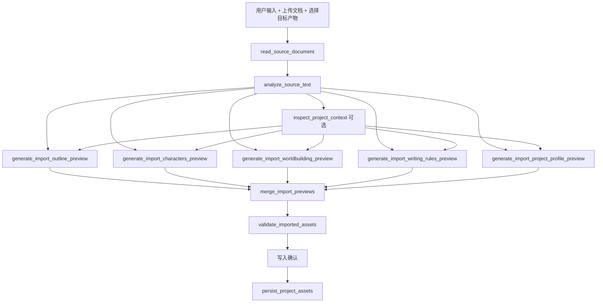

# 按目标产物拆分导入生成 Tool 设计

> 最后更新：2026-05-06  
> 功能名：目标产物驱动的高质量导入预览  
> 关联文档：`docs/architecture/creative-document-import-agent-design.md`  
> 关联任务：`docs/architecture/targeted-import-preview-tools-development-plan.md`

## 1. 背景

当前导入类 Agent 已经支持用户上传文档，并通过 `build_import_preview` 一次性生成项目资料、剧情大纲、角色、世界设定和写作规则等预览。这个方案适合快速导入，但当用户选择多个目标产物时，所有目标都挤在同一次 LLM 调用和同一个通用 prompt 里，容易出现每类产物都有一点但不够深的问题。

用户真正需要的是：导入类工具只增加输入来源，不能把所有导入任务固化为全量流程。用户选择哪些目标产物，Agent 就只生成这些目标产物，并且每类目标产物应尽量使用对应的专用提示词和质量标准。

因此需要把“导入预览生成”从单一通用 Tool 升级为“按目标产物动态编排的 Tool 链路”。

## 2. 目标

1. 目标产物成为结构化输入，而不只依赖自然语言 prompt。
2. Planner 根据用户选择动态编排目标产物生成 Tool，不固定跑全套流程。
3. 每类目标产物使用专用 Tool 和专用提示词，提高生成深度。
4. 多个目标产物共享同一份文档分析结果，避免重复读取文档。
5. 多个目标产物生成后统一合并为 `ImportPreviewOutput`，继续复用现有校验、预览和写入链路。
6. Plan 阶段只生成预览和校验报告，不写库。
7. Act 阶段必须经过写入确认，才调用 `persist_project_assets` 入库。

## 3. 非目标

- 不把上传文档等同于固定全量导入。
- 不绕过现有 Plan/Act 审批机制。
- 不让目标产物 Tool 直接写业务表。
- 不在首版实现多轮协同写作 Agent 或复杂任务队列。
- 不废弃 `build_import_preview`，它保留为兼容和低成本 fallback。

## 4. 当前问题

### 4.1 单次通用生成质量上限较低

`build_import_preview` 当前会把用户指令、文档分析、目标产物范围放进一次 LLM 调用，要求模型一次返回完整 JSON。目标越多，token 分配越紧张，每类内容越容易浅。

### 4.2 目标产物缺少专用提示词

剧情大纲、角色、人设、世界设定、写作规则的评价标准不同：

- 剧情大纲看主线推进、卷章结构、冲突递进和钩子。
- 角色人设看动机、人物弧光、关系和行为约束。
- 世界设定看地点、势力、规则、历史和 locked facts 兼容性。
- 写作规则看视角、口吻、禁写、节奏、结构和一致性约束。

这些不适合长期放在一个泛用导入 prompt 里。

### 4.3 需要保持写入链路统一

虽然生成阶段可以拆分，但写入阶段不应该分散到多个按钮或多个隐式副作用里。导入写入仍应统一进入 `validate_imported_assets` 和 `persist_project_assets`，这样审批、diff、去重、章节覆盖保护和缓存失效逻辑可以保持一致。

## 5. 总体方案

目标方案采用“共享读取分析，按目标分 tool 生成，统一合并校验，确认后统一写入”的结构。



如果用户只选择两个目标产物，例如“剧情大纲 + 写作规则”，Planner 只应编排：

```text
read_source_document
analyze_source_text
generate_import_outline_preview
generate_import_writing_rules_preview
merge_import_previews
validate_imported_assets
persist_project_assets
```

不应生成角色和世界设定。

## 6. 目标产物契约

目标产物沿用当前资产类型：

```ts
type ImportAssetType =
  | 'projectProfile'
  | 'outline'
  | 'characters'
  | 'worldbuilding'
  | 'writingRules';
```

前端点击目标产物按钮时，不应只把选择拼进自然语言，还应把结构化选择传给后端：

```ts
interface AgentPlanTargetProducts {
  requestedAssetTypes?: ImportAssetType[];
}
```

推荐请求体：

```json
{
  "projectId": "project-id",
  "message": "请根据文档生成剧情大纲和写作规则",
  "context": {
    "currentProjectId": "project-id",
    "sourcePage": "agent_workspace",
    "requestedAssetTypes": ["outline", "writingRules"]
  },
  "attachments": []
}
```

后端仍应从自然语言兜底推断目标产物，但结构化选择优先级更高。

## 7. Tool 设计

### 7.1 共享前置 Tool

| Tool | 作用 | LLM | 副作用 |
|---|---|---:|---:|
| `read_source_document` | 读取上传文档正文 | 否 | 无 |
| `analyze_source_text` | 提取段落、关键词、长度等基础分析 | 否 | 无 |
| `inspect_project_context` | 读取当前项目已有资料，避免冲突和重复 | 否 | 无 |

### 7.2 按目标产物生成 Tool

| 目标产物 | Tool | 输出字段 |
|---|---|---|
| 项目资料 | `generate_import_project_profile_preview` | `projectProfile` |
| 剧情大纲 | `generate_import_outline_preview` | `projectProfile.outline`、`volumes`、`chapters` |
| 角色与人设 | `generate_import_characters_preview` | `characters` |
| 世界设定 | `generate_import_worldbuilding_preview` | `lorebookEntries` |
| 写作规则 | `generate_import_writing_rules_preview` | `writingRules` |

所有生成 Tool 都必须：

- `allowedModes = ['plan', 'act']`
- `requiresApproval = false`
- `sideEffects = []`
- 只输出预览，不写业务表
- 明确接收 `requestedAssetTypes` 或自身目标类型
- 使用 `analysis.sourceText`、`analysis.paragraphs`、`analysis.keywords` 和可选 `projectContext`
- 输出稳定结构，字段缺失时归一化为空数组或空对象

### 7.3 合并 Tool

新增 `merge_import_previews`，负责把多个目标 Tool 的输出合并为统一的 `ImportPreviewOutput`。

输入示例：

```json
{
  "requestedAssetTypes": ["outline", "writingRules"],
  "projectProfilePreview": "{{steps.generate_import_project_profile_preview.output}}",
  "outlinePreview": "{{steps.generate_import_outline_preview.output}}",
  "charactersPreview": "{{steps.generate_import_characters_preview.output}}",
  "worldbuildingPreview": "{{steps.generate_import_worldbuilding_preview.output}}",
  "writingRulesPreview": "{{steps.generate_import_writing_rules_preview.output}}"
}
```

输出仍是：

```ts
interface ImportPreviewOutput {
  requestedAssetTypes?: ImportAssetType[];
  projectProfile: {
    title?: string;
    genre?: string;
    theme?: string;
    tone?: string;
    logline?: string;
    synopsis?: string;
    outline?: string;
  };
  characters: CharacterPreview[];
  lorebookEntries: LorebookPreview[];
  writingRules: WritingRulePreview[];
  volumes: VolumePreview[];
  chapters: ChapterPreview[];
  risks: string[];
}
```

合并规则：

- 未选择的目标产物必须为空。
- 同名角色在合并阶段去重并记录 warning。
- 同名世界设定在合并阶段去重并记录 warning。
- 同名写作规则在合并阶段去重并记录 warning。
- 剧情大纲只写 `projectProfile.outline`、`volumes`、`chapters`，不顺手写项目标题、简介等未选择字段。
- `risks` 聚合所有子 Tool 的风险，并标注来源。

## 8. Planner 编排规则

Planner 必须遵守以下规则：

1. 有上传文档或长文本，并且用户要求生成项目资产时，任务类型为 `project_import_preview`。
2. `requestedAssetTypes` 只包含用户明确选择或明确表达的目标产物。
3. 导入类任务不是固定全量流程。只选大纲就只生成大纲，只选写作规则就只生成写作规则。
4. 生成阶段优先使用目标产物专用 Tool。
5. 如果专用 Tool 未注册，才允许 fallback 到 `build_import_preview`。
6. 多个目标产物生成后必须调用 `merge_import_previews`。
7. 合并后的 preview 必须进入 `validate_imported_assets`。
8. 只要存在可写入导入预览，就必须有 `persist_project_assets` 作为需审批步骤。
9. Plan 模式不执行 `persist_project_assets`。

## 9. 质量策略

### 9.1 为什么不完全并行独立生成

分 tool 生成能提升单项质量，但也会带来一致性风险。比如角色 Tool 和大纲 Tool 可能对主角动机理解不一致。

为降低风险，所有目标 Tool 必须共享：

- 同一个 `read_source_document` 输出
- 同一个 `analyze_source_text` 输出
- 同一个用户原始指令
- 同一个结构化 `requestedAssetTypes`
- 同一个项目上下文快照

P1 可以增加 `build_import_brief`，用一次 LLM 生成“全局导入简报”，再让各目标 Tool 以它为共同依据。

### 9.2 何时使用单次 fallback

以下情况可以继续使用 `build_import_preview`：

- 用户选择“全套”但要求只是快速预览。
- 专用 Tool 尚未全部实现。
- LLM 配额或耗时限制要求低成本路径。
- Planner 判定目标产物之间强耦合，需要一次生成先给粗稿。

但 UI 和审计需要标明这是“快速导入预览”，不是“深度拆分预览”。

## 10. 写入确认

生成阶段如何拆分，不改变写入规则：

```text
预览 Tool：不写库
merge_import_previews：不写库
validate_imported_assets：不写库
persist_project_assets：确认后才写库
```

写入确认需要展示：

- 当前计划包含哪些写入步骤
- 本次会写入哪些目标产物
- 未选择的目标产物不会写入
- 写入前 diff 和跳过项

## 11. 前端交互

前端目标产物选择器需要升级为结构化状态：

```ts
selectedTargetIds: ImportAssetType[]
```

提交时：

- 自然语言仍保留完整指令。
- `context.requestedAssetTypes` 传结构化目标产物。
- 聊天气泡可继续展示“只生成这些目标产物”提示。
- Plan 卡片展示本次目标产物。
- 写入确认卡片展示最终会写入的目标产物，而不是泛泛显示“审批控制台”。

## 12. 兼容与迁移

首版可以保持双轨：

- 新计划：优先走目标产物专用 Tool。
- 旧计划或专用 Tool 缺失：继续走 `build_import_preview`。
- `validate_imported_assets` 和 `persist_project_assets` 保持兼容统一 `ImportPreviewOutput`。

迁移时不要删除已有 `build_import_preview` 测试，因为它仍是 fallback。

## 13. 验收标准

### 13.1 单目标

用户选择“剧情大纲”并上传文档：

- Plan 包含 `generate_import_outline_preview`。
- Plan 不包含 `generate_import_characters_preview`、`generate_import_worldbuilding_preview`、`generate_import_writing_rules_preview`。
- Artifact 只展示大纲相关预览和校验报告。
- 确认后只写 `Project.outline`、`Volume`、`Chapter`。

### 13.2 双目标

用户选择“剧情大纲 + 写作规则”：

- Plan 包含两个目标 Tool。
- `merge_import_previews.requestedAssetTypes = ['outline', 'writingRules']`。
- 校验报告包含章节和写作规则统计。
- 确认后不写角色和世界设定。

### 13.3 全套

用户选择“全套”：

- Plan 可以包含五个目标 Tool，或在快速模式下 fallback 到 `build_import_preview`。
- UI 明确显示本次会生成和写入的目标产物。
- 写入仍必须审批。

### 13.4 Planner 漏写入步骤

如果 Planner 生成了导入预览但漏掉 `persist_project_assets`：

- 后端规范化阶段补齐需审批写入步骤。
- Plan 阶段仍不写库。
- 用户确认后才写库。

## 14. 风险

| 风险 | 影响 | 缓解 |
|---|---|---|
| 多 Tool 增加 LLM 成本 | 全套导入成本变高 | 支持快速模式 fallback |
| 多 Tool 结果不一致 | 角色、大纲、设定互相冲突 | 共享分析结果，P1 增加 `build_import_brief` |
| Planner 编排复杂 | 漏 tool 或多跑未选目标 | 结构化 `requestedAssetTypes`，加计划归一化测试 |
| 合并逻辑复杂 | 字段覆盖不明确 | 所有目标产物只写自己的字段 |
| UI 误导写入范围 | 用户误以为全写或未写 | 写入确认展示目标产物和写入步骤 |

